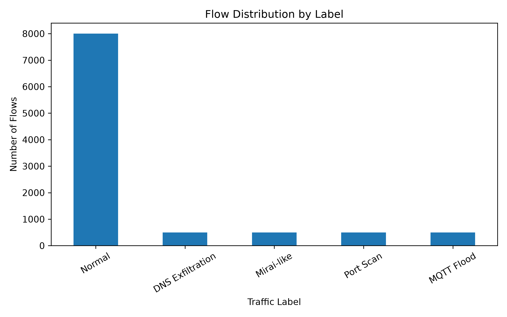
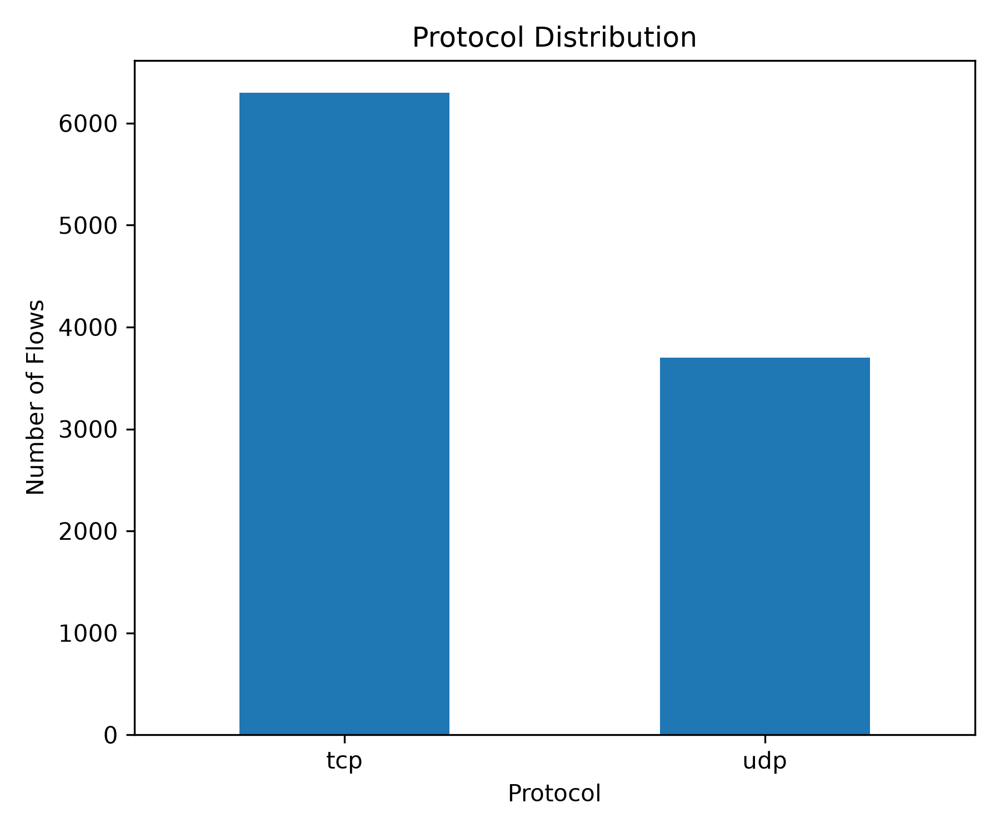
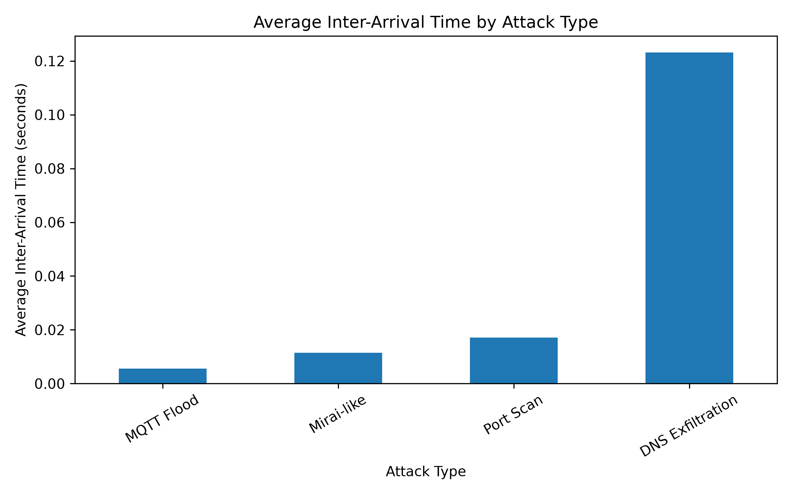

[🇬🇷 Ελληνική έκδοση](README_GR.md)

# IoT Traffic Generator

A parameterized synthetic IoT network traffic generator developed for
cybersecurity research and experimentation.

The system generates both normal and malicious IoT network traffic,
produces PCAP files, extracts network flows using Zeek, and generates
labeled CSV datasets for network security research and intrusion
detection experiments.


---

## Features

- Synthetic IoT network traffic generation
- Normal DNS, HTTP and MQTT traffic
- Port Scan simulation
- MQTT Flood simulation
- DNS Exfiltration simulation
- Mirai-like scanning simulation
- Configurable normal / attack traffic ratio
- Configurable attack type ratios
- IoT device profiles
- Configurable attack bursts
- Reproducible experiments using a configurable random seed
- PCAP generation using Scapy
- Network flow extraction using Zeek
- Automatic flow labeling
- CSV dataset generation
- Dataset validation
- Statistical analysis
- Automatic visualization and plot generation

---

## Technologies

- Python 3
- Scapy
- Pandas
- Matplotlib
- TShark
- Wireshark
- Zeek
- WSL / Ubuntu

---

## Project Structure

```text
iot-traffic-generator/
├── generators/
│   ├── attack_generator.py
│   ├── dns_generator.py
│   ├── http_generator.py
│   └── mqtt_generator.py
├── processing/
│   ├── dataset_pipeline.py
│   ├── plots.py
│   ├── statistics.py
│   ├── traffic_pipeline.py
│   ├── validation.py
│   ├── zeek_processor.py
│   ├── tshark_processor.py
│   ├── dataset_builder.py
│   └── feature_extractor.py
├── config.py
├── main.py
├── requirements.txt
└── README.md
```

Generated files are stored in the `output/` directory when the system is executed.

---

## Installation

### 1. Clone the repository

```bash
git clone https://github.com/Georgedok7/iot-traffic-generator.git
cd iot-traffic-generator
```

### 2. Create a Python virtual environment

```bash
python -m venv .venv
```

### 3. Activate the virtual environment

On Windows PowerShell:

```powershell
.venv\Scripts\Activate.ps1
```

### 4. Install Python dependencies

```bash
pip install -r requirements.txt
```

### 5. Install external tools

Zeek and TShark must be installed separately.

The current implementation executes Zeek through WSL / Ubuntu.

---

## Configuration

The main traffic generation parameters are defined in:

```text
config.py
```

For example:

```python
RANDOM_SEED = 42
TOTAL_FLOWS = 10000
ATTACK_RATIO = 0.20

DNS_RATIO = 0.40
HTTP_RATIO = 0.30
MQTT_RATIO = 0.30
```

The configuration also controls:

- Normal protocol ratios
- Attack type ratios
- IoT device profiles
- Attack burst sizes
- Traffic timing parameters

Before execution, the system validates the configured traffic ratios and other required parameters.

---

## Running the Generator

Run the complete pipeline with:

```bash
python main.py
```

The execution pipeline is:

```text
Configuration Validation
          ↓
Traffic Count Calculation
          ↓
Normal Traffic Generation
          ↓
Attack Traffic Generation
          ↓
Normal / Attack Mixing
          ↓
Traffic Blocks & Attack Bursts
          ↓
PCAP Generation
          ↓
Zeek Flow Extraction
          ↓
Automatic Flow Labeling
          ↓
CSV Dataset Generation
          ↓
Statistics & Visualization
          ↓
Dataset Validation
```

---

## Traffic Generation

### Normal Traffic

The generator supports three types of normal IoT traffic:

- DNS
- HTTP
- MQTT

Different IoT device profiles use different protocol distributions.

The included profiles are:

- Temperature Sensor
- Smart Camera
- Thermostat
- Gateway

Each profile has its own IP address and protocol usage weights.

This allows the generated normal traffic to represent multiple IoT devices with different communication patterns.

---

## Attack Scenarios

The generator supports four malicious traffic scenarios.

### Port Scan

Generates TCP SYN packets targeting different destination ports.

### MQTT Flood

Generates a high-volume sequence of MQTT publish packets targeting an MQTT broker on port `1883`.

### DNS Exfiltration

Generates DNS queries containing encoded-looking data within generated subdomains.

### Mirai-like Scanning

Generates TCP SYN packets targeting randomly selected IP addresses and commonly targeted ports such as:

- `23`
- `2323`
- `80`
- `8080`

These scenarios are designed to reproduce characteristic network traffic patterns for cybersecurity research rather than to execute actual malware.

---

## Attack Bursts

Attack traffic is organized into bursts with configurable sizes.

The timing parameters differ between attack types.

For example:

- MQTT Flood uses very short inter-arrival times.
- Mirai-like scanning uses rapid scanning activity.
- Port Scan generates rapid connections to different ports.
- DNS Exfiltration uses more spaced-out DNS requests.

This allows the generated traffic to contain different temporal patterns between attack scenarios.

---

## Reproducibility

The generator uses a configurable random seed:

```python
RANDOM_SEED = 42
```

Using the same configuration and random seed allows the same synthetic experiment to be reproduced.

Changing the random seed produces different random selections such as traffic event ordering, ports, device selections and attack bursts.

---

## PCAP and Dataset Generation

The generated traffic is written to a PCAP file using Scapy.

The PCAP is then processed using Zeek to extract network flow information.

The resulting flow data includes fields such as:

- Source IP
- Source Port
- Destination IP
- Destination Port
- Protocol
- Service
- Duration
- Original Bytes
- Response Bytes
- Original Packets
- Response Packets

The extracted flows are matched against the generated traffic metadata and automatically assigned a label.

---

## Dataset Labels

The generated dataset uses the following labels:

```text
normal
port_scan
mqtt_flood
dns_exfiltration
mirai_like
```

In the final experiment, the generator was configured to produce:

```text
10,000 traffic events
80% normal traffic
20% attack traffic
```

The attack traffic was distributed equally between the four attack scenarios:

```text
8,000 normal
500 port scan
500 MQTT flood
500 DNS exfiltration
500 Mirai-like
```

The final experiment produced:

```text
10,000 traffic events
27,600 raw packets
10,000 labeled Zeek flows
```

---

## Results

The generated traffic was analyzed to examine its label distribution,
protocol composition and temporal characteristics across attack types.

### Traffic Label Distribution



The generated dataset contains both normal and malicious traffic,
with the four attack scenarios distributed according to the configured
attack ratio.

### Protocol Distribution



The generated traffic includes TCP and UDP communication resulting from
the supported DNS, HTTP, MQTT and attack scenarios.

### Average Inter-Arrival Time by Attack Type



Different attack scenarios exhibit distinct temporal characteristics,
reflecting the different timing profiles used during traffic generation.

---

---

## Statistical Analysis

After dataset generation, the system calculates statistics including:

- Total number of flows
- Label distribution
- Protocol distribution
- Average flow duration
- Average packets per flow
- Average bytes per flow
- Most common destination ports
- Statistics by traffic label
- Attack burst duration
- Average inter-arrival time

---

## Visualization

The system automatically generates plots for:

- Flow distribution by label
- Protocol distribution
- Top destination ports
- Average inter-arrival time by attack type

The generated plots are stored under:

```text
output/plots/
```

---

## Dataset Validation

The final dataset is automatically validated.

The validation process checks:

- Expected number of flows
- Missing labels
- Labeling completeness
- Required dataset columns
- Configuration validity

A successful validation produces results such as:

```text
Flow count: OK
Missing labels: OK
Labeling: OK
Required columns: OK
```

---

## Output

The main generated files are:

### PCAP

```text
output/pcap/final_mixed_traffic.pcap
```

### Labeled Flow Dataset

```text
output/csv/final_flow_dataset.csv
```

### Attack Burst Statistics

```text
output/csv/attack_burst_statistics.csv
```

### Plots

```text
output/plots/
```

---

## Research Context

This project was developed as part of a bachelor's thesis on synthetic IoT network traffic generation and its application to cybersecurity research.

The generated traffic and datasets are intended for research, experimentation and educational use, including network analysis and intrusion detection experiments.

The attack scenarios simulate characteristic patterns of malicious network behavior without implementing or executing real malware or performing attacks against real networks.
